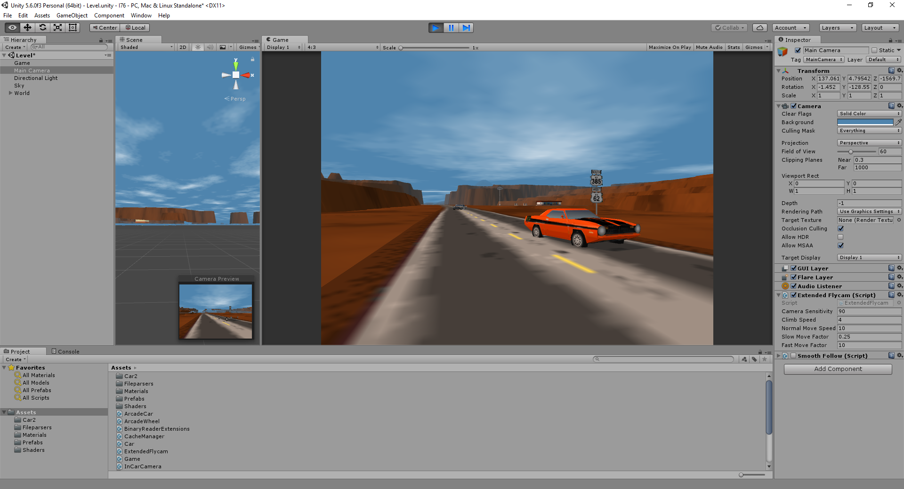
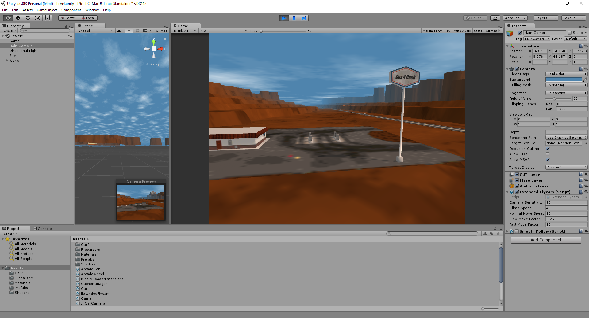
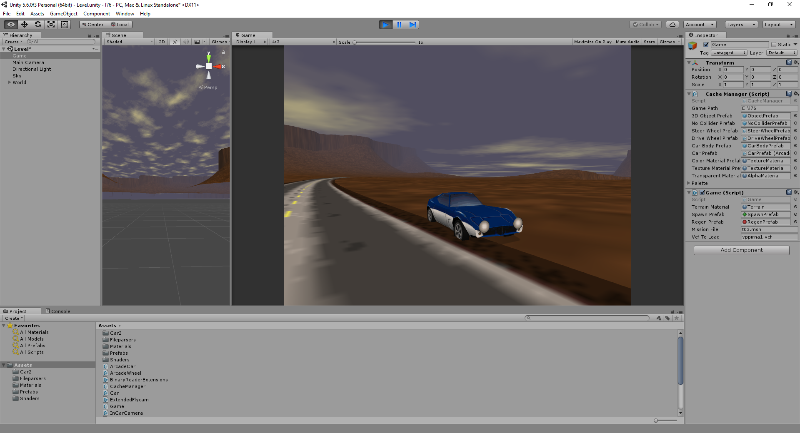
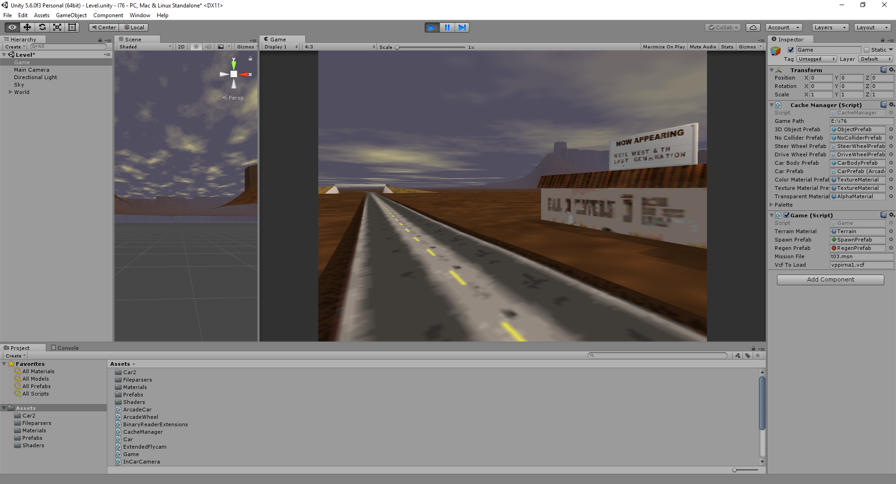
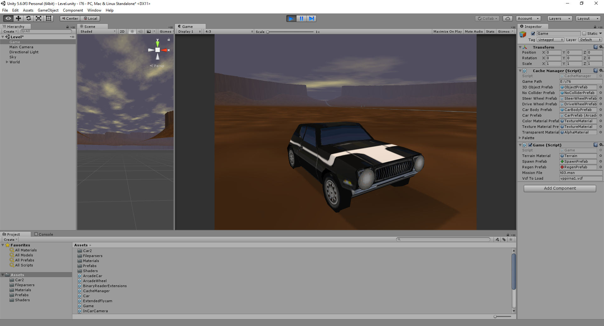
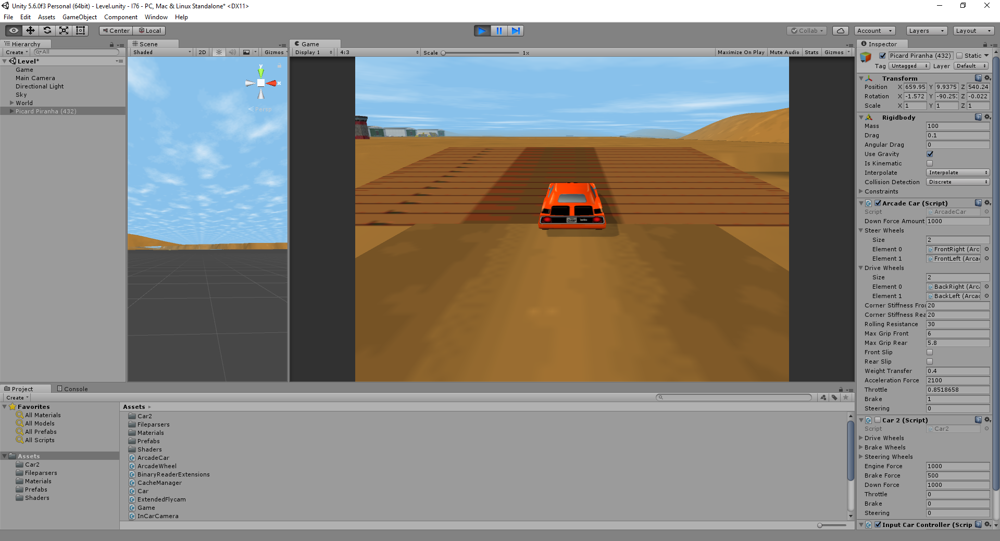
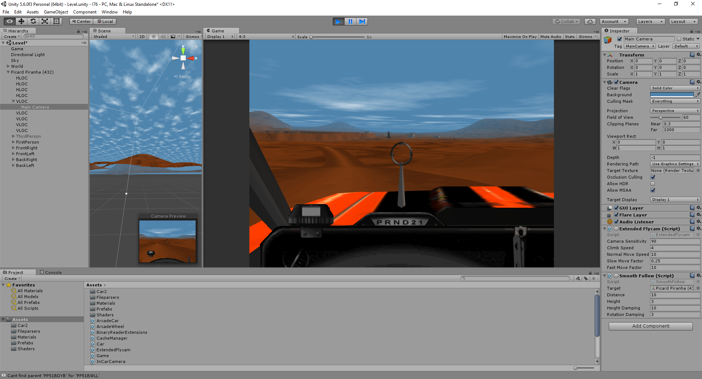

# Open76

Open76 is an engine reimplementation of Activision's Interstate '76 on the Unity platform.

## What works?
Parsing and rendering of pretty much everything contained in a level (including cars).

The mission stack machines are now underway; Open76 can parse and run the stack machines. However, there's still a lot of machine actions that needs implementation.

The simulation does not work yet. Driving around works as well as the various camera modes. The car simulation needs a lot of work (engine simulation, gearbox, etc.).

Some features of the above are not yet fully implemented or have problems - see Issues.

## How do I run it?
1. Open Level.scene in Unity.
2. Find the gameobject called "Game" and set the "Game path" property to your Interstate '76 install directory.

~~For now, Open76 requires the uncompressed ZFS of version 1.0 as delivered on the original CD. It cannot parse the compressed ZFS present in later versions.~~ 

Open76 can now parse both the original uncompressed version and the compressed version of the ZFS. Nitro pack seems to have a different mission file format, this needs to be investigated.

## How do I contribute?
Fork this repository. Look in the Issues list. Communicate that you're committing to fixing an issue and finally submit a pull request.

## Why?
For fun. Tinkering with Interstate '76 started many years ago, but I never made much progress on the monstrous number of file formats presented. Until early 2017 when I discovered that blogger "That Tony" reverse engineered many of the formats on his blog http://hackingonspace.blogspot.se. Some formats had been reversed years ago by modders, although these specifications were hard to find since most of the sites were long gone (bless web-archive!).

In my opinion, Interstate '76 is one of the best games ever made. It suffers from an aging engine though, and in recent years it has become increasingly harder to play it on modern platforms.
The primary goal of this project is to provide the same playing experience in a modern engine while conforming to the original data file specifications.
A long term goal is to extend the engine with various modern features, such as HMD and VR support.

## Acknowledgements
Without "That Tony"'s wonderful blog (http://hackingonspace.blogspot.se) and reverse engineering skills, this project would never have gotten anywhere. Tony reverse-engineered most of the formats used by I76.

## More screenshots

## License
Licensed under the GPL version 3.

This is in no way affiliated with or endorsed by Activision or any other company.
